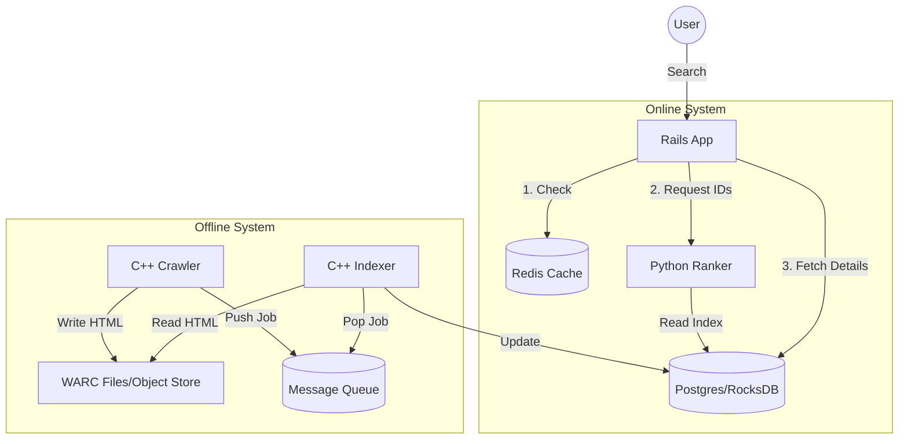

# Google-Like Search Engine - Scalable Architecture Plan

**Project Overview:** A high-performance, distributed search engine designed to crawl, index, and rank web content at scale.
**Architecture Style:** Microservices-based, Event-Driven (Queue-based).

## Technology Stack

| Component | Technology | Reasoning |
| :--- | :--- | :--- |
| **Crawler** | **C++ (C++17/20)** | High concurrency, low memory footprint, raw socket control. |
| **Indexer** | **C++** | Fast string processing, heavy I/O optimization. |
| **Ranker** | **Python (NumPy/Flask)** | Scientific computing (Matrix operations), rapid algorithm prototyping. |
| **Interface** | **Ruby on Rails** | Robust MVC, rapid frontend development, API orchestration. |
| **Queues** | **Redis / RabbitMQ** | Decoupling components for asynchronous processing. |
| **Storage** | **PostgreSQL & RocksDB** | Structured data and high-performance key-value storage. |
| **DevOps** | **Docker & K8s** | Containerization and orchestration. |

-----

## Phase 1: The Spider (Web Crawler)

### Goal

A distributed, polite, and fault-tolerant web crawler capable of fetching millions of pages without memory exhaustion.

### Components

#### 1.1 URL Frontier (Manager)

  * **Visited Check:** **Bloom Filter** (Probabilistic check for speed) + **Redis Set** (Authoritative check).
      * *Why:* A `std::unordered_set` of strings consumes GBs of RAM. A Bloom Filter uses MBs.
  * **Priority Queue:** `Redis Sorted Set` or `RabbitMQ`.
      * *Why:* Allows persistence. If the crawler crashes, the queue is not lost.

#### 1.2 The Fetcher (Worker)

  * **Language:** C++
  * **Library:** `libcurl` (Multi Interface) or `Boost.Beast`.
  * **DNS Caching:** Custom local LRU cache to reduce DNS lookup latency.
  * **Politeness:** Enforced via `robots.txt` parser (cached) and per-domain rate limiting (Token Bucket algorithm).

#### 1.3 Storage Strategy (The "Inode" Fix)

  * **Format:** **WARC (Web ARChive)** with **GZIP Member Concatenation**.
  * **Strategy:** Append HTML content to large 1GB files (e.g., `data/crawled_001.warc.gz`).
      * *Critical Detail:* Each page is compressed individually and appended. This allows `zlib` to decompress just that chunk using the byte offset, enabling random access.
  * **Metadata:** Stored in **PostgreSQL**.
    ```sql
    TABLE documents (
        id SERIAL PRIMARY KEY,
        url TEXT UNIQUE,
        file_path TEXT, -- e.g., "data/crawled_001.warc.gz"
        offset BIGINT,  -- Byte offset in the file
        length INT,
        crawled_at TIMESTAMP
    );
    ```

-----

## Phase 2: The Processor (Indexer)

### Goal

Transform raw HTML into a highly optimized Inverted Index using the BM25 scoring readiness.

### Components

#### 2.1 The Tokenizer Pipeline

  * **Input:** Reads batches from the Message Queue (e.g., "New WARC file ready").
  * **Processing:**
    1.  **HTML Stripping:** `gumbo-parser`.
    2.  **Normalization:** UTF-8 case folding, accent removal.
    3.  **Stop Words:** Custom efficient `std::frozen::set`.
    4.  **Stemming:** Porter2 Stemmer implementation.

#### 2.2 The Inverted Index (Storage Fix)

  * **Structure:**
      * **Term Dictionary:** Maps `word` -> `term_id`.
      * **Postings List:** Maps `term_id` -> `[doc_id, term_frequency, doc_length]`.
  * **Storage Backend:** **RocksDB** (LevelDB fork) for the Index; **PostgreSQL** for Metadata.
      * *Why:* RocksDB is a Key-Value store optimized for fast lookups of posting lists (byte arrays). Postgres is used only for relational data (URLs, Titles) to avoid table bloat.

#### 2.3 BM25 Pre-calculation

  * During indexing, calculate and store `doc_length` for every document.
  * Maintain a running average of document lengths (`avgdl`) for the BM25 formula.

-----

## Phase 3: The Brain (Ranking Service)

### Goal

Serve relevant results in <100ms using Vector Space Models or Probabilistic Models.

### Technology: Python

#### 3.1 Ranking Algorithm (BM25)

Standard TF-IDF is insufficient for long documents. We implement **Okapi BM25**.

$$Score(D,Q) = \sum_{i=1}^{n} IDF(q_i) \cdot \frac{f(q_i, D) \cdot (k_1 + 1)}{f(q_i, D) + k_1 \cdot (1 - b + b \cdot \frac{|D|}{avgdl})}$$

  * **Implementation:** Vectorized operations using **NumPy** or **SciPy Sparse Matrices**.
  * **Optimization:** Loading the Index via **Memory Mapping (`mmap`)** if using binary files, or efficient SQL queries.

#### 3.2 Microservice Architecture

  * **Framework:** Flask or FastAPI.
  * **Endpoint:** `GET /search?q=query&limit=10`.
  * **Caching:** **Redis LRU Cache** for frequent queries (e.g., "Facebook", "Youtube").

-----

## Phase 4: The Interface (Web Layer)

### Technology: Ruby on Rails

#### 4.1 Architecture

  * **Role:** The Orchestrator. It does not calculate; it delegates.
  * **Flow:**
    1.  User inputs query.
    2.  Rails checks **Redis** (Cache Hit?).
    3.  If Miss: Rails calls **Python Ranker API**.
    4.  Ranker returns List of Doc IDs: `[105, 23, 900]`.
    5.  Rails queries **PostgreSQL** for Title/URL/Snippet of those IDs.
    6.  Rails renders HTML.

#### 4.2 Snippet Generation

  * **Highlighter:** Efficient regex to find query terms in the document text and wrap them in `<b>` tags.
  * **Context:** Extract ~150 characters around the highest density of query terms.

-----

## Phase 5: DevOps & Infrastructure (The "Google" Way)

### 5.1 Containerization

  * **Docker:** Every component (Crawler, Indexer, Ranker, Rails) has its own `Dockerfile`.
  * **Multi-stage Builds:** Use build artifacts to keep C++ images small (Alpine Linux).

### 5.2 Orchestration

  * **Docker Compose:** For local development.
  * **Kubernetes (K8s):** For production scaling.
      * *Scenario:* If the crawl queue grows to >10,000 items, K8s auto-scales the Crawler Pods.

### 5.3 Monitoring (Observability)

  * **Prometheus:** Scrapes metrics.
      * `crawler_pages_per_second`
      * `ranker_latency_ms`
  * **Grafana:** Visualizes the health of the system.

-----

## Data Flow Diagram



-----

## Project Structure (Revised)

```
Google-Lite/
├── cpp/
│   ├── crawler/
│   │   ├── Dockerfile
│   │   ├── src/ (libcurl, bloom_filter)
│   ├── indexer/
│   │   ├── Dockerfile
│   │   ├── src/ (rocksdb_adapter, tokenizer)
├── python/
│   ├── ranker/
│   │   ├── Dockerfile
│   │   ├── app.py (Flask)
│   │   ├── engine.py (BM25 Logic)
├── rails/
│   ├── app/ (UI & Controllers)
│   ├── Dockerfile
├── infra/
│   ├── docker-compose.yml
│   ├── k8s/ (Kubernetes manifests)
│   ├── terraform/ (GCP/AWS Provisioning)
│   ├── prometheus/ (Monitoring config)
├── data/ (Mounted Volumes)
│   ├── postgres_data/
│   ├── redis_data/
│   ├── raw_warc/
└── README.md
```

-----

## Development Roadmap (The "Walking Skeleton")

1.  **Phase 0 (Setup):** Docker Compose with Rails + Python Flask (Hello World).
2.  **Phase 1 (Manual Data):** Python Ranker returns results from a hardcoded JSON list. Rails displays it.
3.  **Phase 2 (The Crawler):** C++ Crawler fetches real pages to WARC files.
4.  **Phase 3 (The Connection):** C++ Indexer parses WARC -> updates Postgres. Python reads Postgres.
5.  **Phase 4 (Optimization):** Add Redis caching and Bloom Filters.
